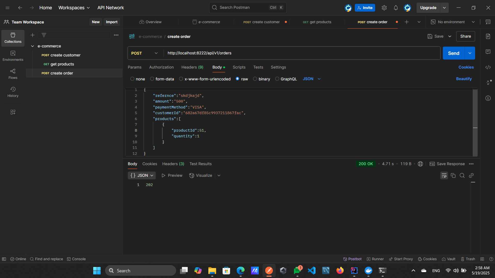

# 🌟 microservice-ecommerce

A scalable, cloud-native **Order Management System** built with **Spring Boot 3** and **Spring Cloud** using a microservices architecture. This modern e-commerce platform supports high performance, maintainability, and seamless integration by leveraging best practices in distributed systems.

---

## 🚀 Project Overview

**microservice-ecommerce** is designed to handle core aspects of an e-commerce system through loosely coupled microservices. The platform manages customers, products, orders, payments, and notifications with scalability and resilience in mind.

Key capabilities include:
- Modular microservices for independent deployment and scaling
- Real-time asynchronous communication using Kafka
- Centralized configuration management
- Secure authentication and authorization with Keycloak
- Observability via distributed tracing (Zipkin)
- Flexible data persistence strategies with MongoDB and PostgreSQL
- Containerized deployment using Docker

---

## 🎯 Key Features

- **Microservices Architecture:** Modular, independent services to enhance scalability and maintainability.  
- **Asynchronous Messaging:** Apache Kafka enables real-time, event-driven communication between services.  
- **Distributed Tracing:** Zipkin integration provides observability across service boundaries.  
- **Centralized Configuration:** Spring Cloud Config Server for consistent configurations across services.  
- **Secure Access:** Keycloak handles authentication and role-based authorization.  
- **Hybrid Database Strategy:** MongoDB for flexible document storage and PostgreSQL for relational data.  
- **Service Discovery:** Eureka Server for dynamic service registration and discovery.  
- **API Gateway:** Single entry point routing and request filtering.  
- **Containerization:** Docker for portable and scalable deployment.

---

## 🛠 Technologies Used

| Technology          | Purpose                                |
|---------------------|--------------------------------------|
| Spring Boot 3       | Framework for microservices           |
| Spring Cloud        | Distributed system tooling             |
| Apache Kafka        | Event-driven asynchronous messaging   |
| Zipkin              | Distributed tracing and monitoring    |
| Config Server       | Centralized configuration management  |
| API Gateway         | Unified client entry point             |
| Keycloak            | Authentication & authorization        |
| MongoDB             | NoSQL document database                |
| PostgreSQL          | Relational database                    |
| Eureka Server       | Service registry and discovery        |
| Docker              | Containerization and deployment       |

---

## 🏗 Microservices Breakdown

| Microservice          | Responsibilities                                      |
|-----------------------|-------------------------------------------------------|
| **Customer Service**   | Manage customer data (first name, last name, email) and linked customer addresses (street, house number, zip code). |
| **Product Service**    | Handle product and category management, including product details such as name, description, available quantity, and price. |
| **Order Service**      | Manage order processing and tracking. Links to order lines for individual items (quantity), payments, and notifications. |
| **Payment Service**    | Validate and process payments asynchronously via Kafka. Stores payment details including reference, amount, and status. |
| **Notification Service** | Send real-time notifications and updates. Manage notification data like sender, recipient, content, and timestamp. |

---

## 📊 Domain Model & Diagrams

### Entity Relationship Diagram (ERD)

### Domain-Driven Design (DDD)

---

### Domain Relationships Summary

- **Customer Domain:**  
  `Customer` (id, firstname, lastname, email) linked to multiple `Address` (id, street, houseNumber, zipCode).

- **Product Domain:**  
  `Product` (id, name, description, availableQuantity, price) linked to `Category` (id, name, description).

- **Order Domain:**  
  `Order` (id, orderDate, reference) linked to `OrderLine` (id, quantity), `Customer`, `Payment`, and `Notification`.

- **Payment Domain:**  
  `Payment` (id, reference, amount, status).

- **Notification Domain:**  
  `Notification` (id, sender, recipient, content, date).

---

## 🏛 Architecture Overview

- **API Gateway:** Routes incoming requests to respective microservices (`/customers`, `/products`, `/orders`).  
- **Service Discovery:** Eureka Server manages dynamic registration and discovery of services.  
- **Event Streaming:** Kafka handles asynchronous communication for events such as payment and order confirmations.  
- **Distributed Tracing:** Zipkin monitors and traces requests across services.  
- **Databases:**  
  - MongoDB for flexible document-oriented data.  
  - PostgreSQL for structured, relational data.  
- **Configuration:** Centralized through Spring Cloud Config Server.

---

## 🧰 Project Structure

Each microservice is a standalone Spring Boot application responsible for a specific bounded context/domain, containerized via Docker, and communicating asynchronously through Kafka.

The main domains include:  
- Customer & Address  
- Product & Category  
- Order & OrderLine  
- Payment  
- Notification

---

## 🚀 Getting Started

### Prerequisites

Ensure the following are installed and running:  
- Java 17+  
- Maven  
- Docker & Docker Compose  
- MongoDB  
- PostgreSQL  
- Apache Kafka & Zookeeper  
- Keycloak  
- Zipkin  

---

## 🎓 Learning Outcomes

Working on **microservice-ecommerce** helps you master:  
- Microservices design and architecture best practices  
- Building cloud-native applications with Spring Boot and Spring Cloud  
- Event-driven asynchronous communication with Kafka  
- Implementing distributed tracing and observability with Zipkin  
- Secure authentication and authorization using Keycloak  
- Containerized application development and deployment using Docker  

---

## 🏆 Project Demonstration & Success Tests

Here are some highlights of the working microservice-ecommerce system in action, showing container status, database contents, API requests, and monitoring:

### Docker Containers Running Successfully  
  
All core microservices are running smoothly in Docker containers, including Customer, Product, Order, Payment, Notification, and others.

### MongoDB Customer Data in Mongo Express  
  
Customer documents with embedded address details stored and retrieved from MongoDB.

### PostgreSQL Product Table in pgAdmin  
  
Relational product data displayed in PostgreSQL with details such as name, price, quantity, and category.

### API Requests Tested in Postman  
- **Create Customer**  
  
Successfully creating a customer with JSON payload.  
- **Get Products**  
  
Fetching product listings via GET request, returning accurate data.

### Order Creation & Payment Confirmation  
- **Create Order**  
  
Order created successfully with valid product references and quantities.  
- **Email Notifications Received**  
  
Confirmation emails for payment processed and order placed received in the MailDev inbox.

### Service Discovery via Eureka  
  
All microservices dynamically registered and available through Eureka service registry.

### Distributed Tracing with Zipkin  
  
Request tracing across the gateway and customer service for end-to-end observability.

### Applied Security with Keycloak  
  
Secure authentication and role-based authorization implemented using Keycloak.
---

## 📬 Contact

Feel free to reach out for questions, suggestions, or collaboration:  
✉️ [doaayehia318@gmail.com](mailto:doaayehia318@gmail.com)

---
